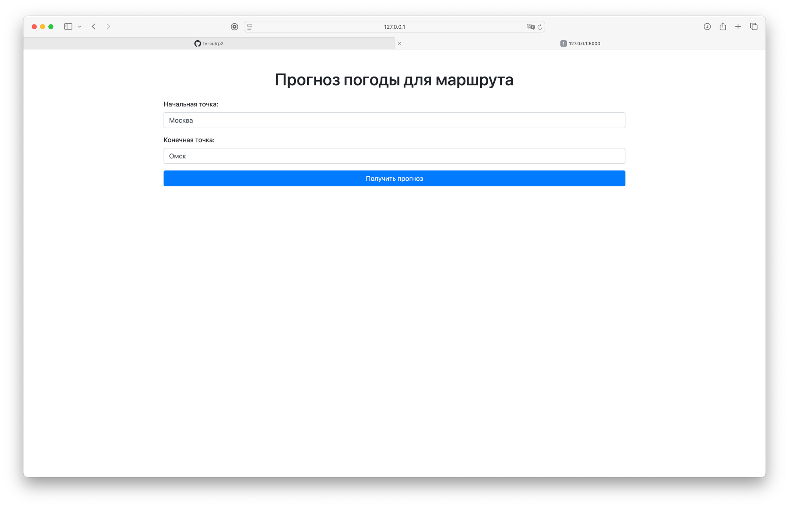
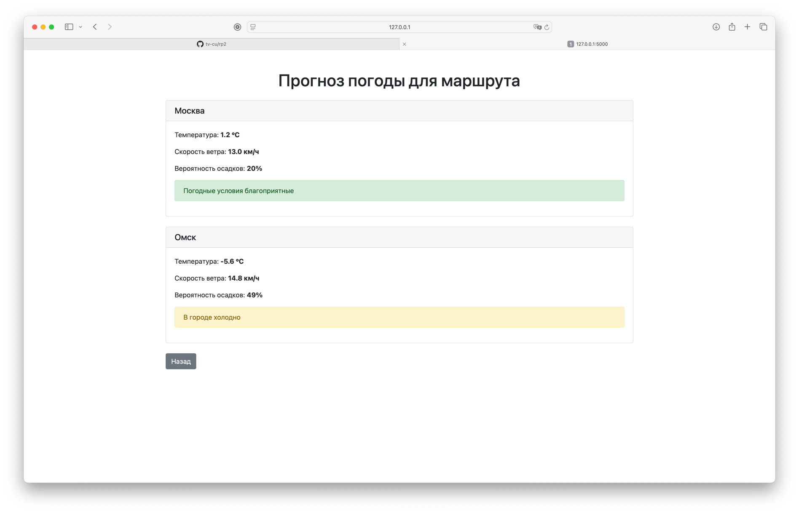
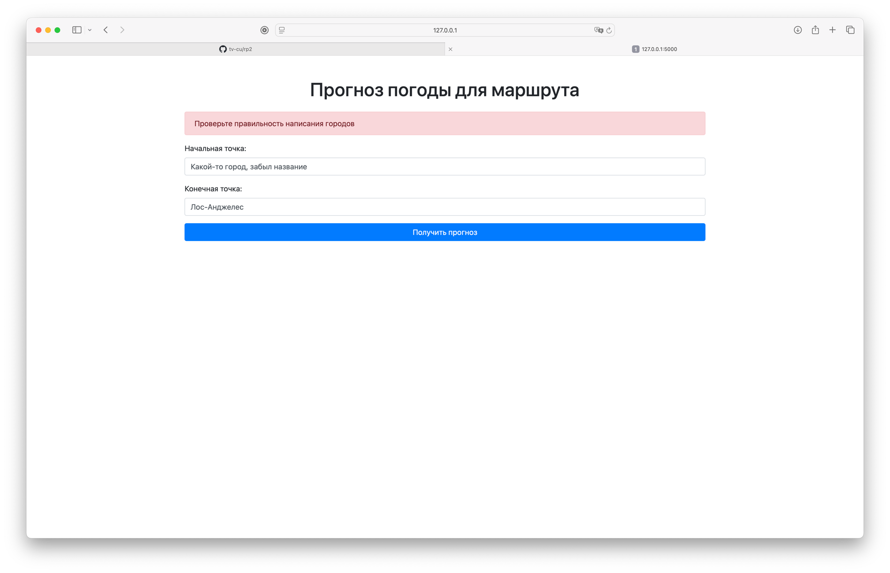

# Веб-сервис с прогнозом погоды для заданного маршрута



## Описание

Веб-сервис, который предсказывает вероятность плохой погоды для заданного маршрута, используя данные AccuWeather API



## Функциональность

- **Прогноз по запросу пользователя**: прогноз погоды в городах отправления и прибытия.
- **Получение данных о погоде**: приложение получает данные о погоде из AccuWeather API.
- **Определение неблагоприятных условий**: используется модель, определяющая неблагоприятные погодные условия на основе
  параметров погоды.
- **Приятный интерфейс**: использование Bootstrap для красивого отображения информации
- **Отображение результатов**: пользователь получает информацию о погоде и вердикт на основе данных из API
- **Обработка ошибок**: система работает стабильно, так как ошибки (некорректный ввод города или ошибка со стороны AccuWeather) отображаются понятно и вписываются в интерфейс



## Установка и запуск

1. Клонируйте репозиторий:

```bash
git clone https://github.com/tv-cu/rp2.git
```
2. Перейдите в директорию проекта:

```bash
cd rp2
```
3. Установите необходимые зависимости:

```bash
pip install -r requirements.txt
```

4. При необходимости измените API-ключ в `.env` файле

5. Запустите приложение:

```bash
python -m flask run
```

6. Перейдите по адресу `http://127.0.0.1:5000`

7. Пользуйтесь! Просто введите названия городов и нажмите на кнопку "Получить прогноз"
